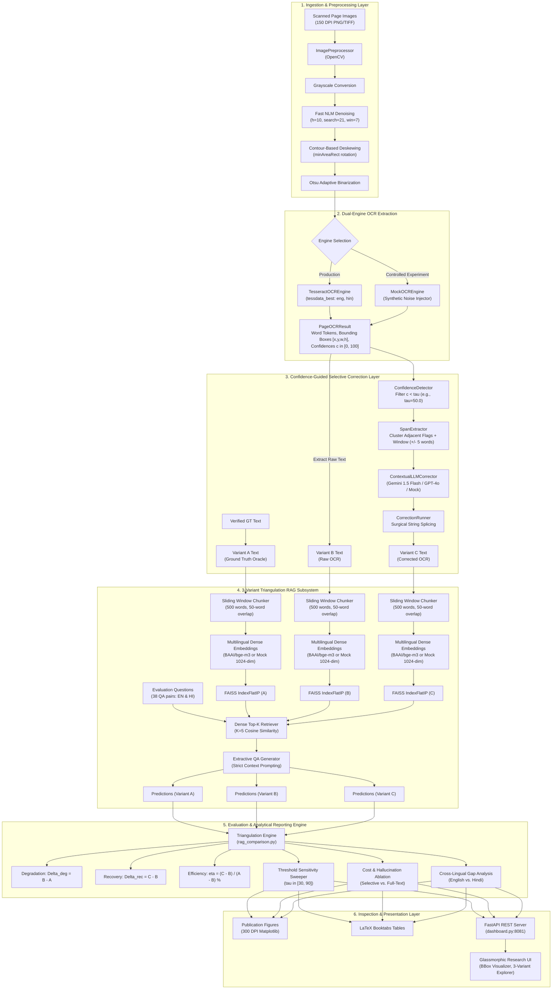
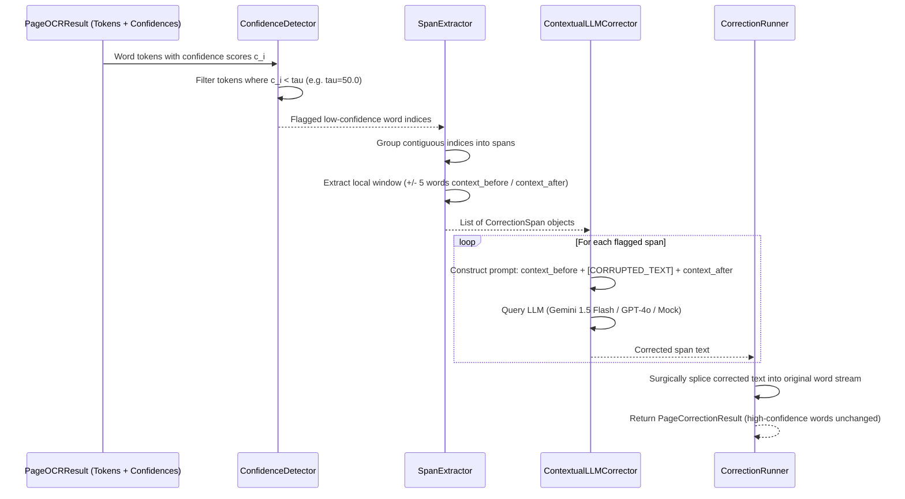
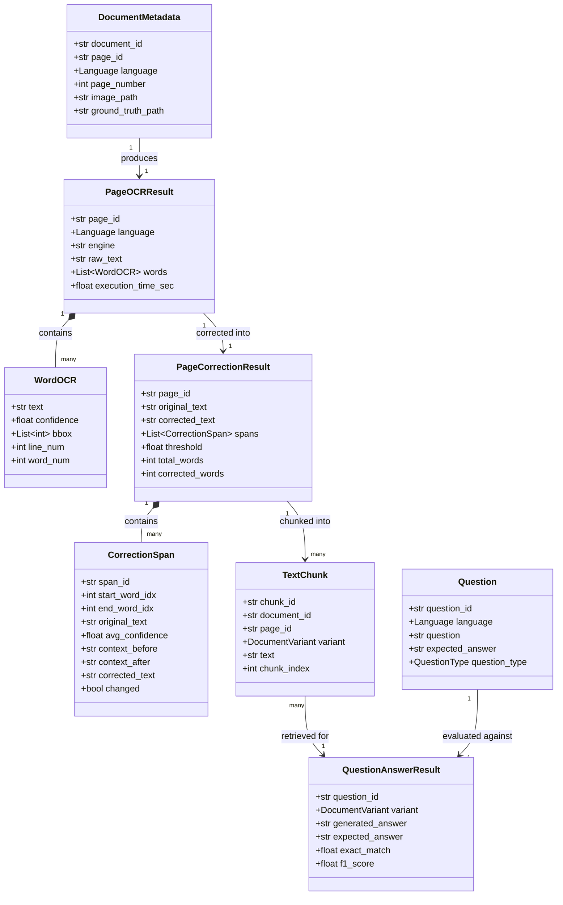

# System Architecture: Multilingual OCR-RAG Research Framework

> **Reference Specification**: Academic Prototype for *"Evaluating and Mitigating OCR-Induced Errors in Multilingual RAG: A Study of English and Hindi Documents"*  
> **Repository Root**: `d:\New folder (3)`  
> **Architecture Status**: Verified & Production-Grade (13 Implementation Phases, 70/70 Automated Unit & Regression Tests Passing)

---

## 1. Executive Architectural Summary

### 1.1 Purpose and Research Mission
This software system is an empirical, controlled research framework engineered to investigate and mitigate the cascading failure modes caused by **Optical Character Recognition (OCR) noise** when propagated through **Multilingual Retrieval-Augmented Generation (RAG)** pipelines.

The core research objectives formalized in this architecture are:
1. **Error Propagation Quantification**: Measure the differential sensitivity of **Dense Semantic Retrieval** (via multilingual embeddings such as BAAI/BGE-M3 and FAISS) versus **Downstream Generative QA** (via LLMs such as Google Gemini, OpenAI GPT-4o, and Mistral) when subjected to real-world and synthetic document scan degradations.
2. **Selective vs. Full-Text Correction Validation**: Empirically prove that **Confidence-Guided Selective Correction** ($c < \tau$ with local contextual windows $\pm 5$ words) achieves superior factual fidelity, eliminates LLM hallucinations, and drastically cuts token overhead compared to unconstrained whole-document LLM rewriting.
3. **Cross-Lingual Asymmetry Analysis**: Analyze the structural degradation gap between the **Latin linear alphabet** (English) and the **Devanagari 2-dimensional abugida** (Hindi: matras, viramas/halants, conjunct ligatures, and nuktas).
4. **Pareto Operating Knee Optimization**: Locate the operational threshold $\tau^*$ that maximizes Question Answering Exact Match (EM) and Token F1 while minimizing computational cost and API latency.

### 1.2 Core Architectural Principles

```
+---------------------------------------------------------------------------------------------------+
|                                  ARCHITECTURAL INVARIANTS                                         |
+------------------------------------+------------------------------------+-------------------------+
|      Strict Triangulation          |      Surgical Immutability         |     Offline Fallback    |
| Document Variants A, B, and C      | High-confidence OCR words (c >= t) | 100% testable without   |
| share strictly identical indexing, | are preserved bitwise to prevent   | external APIs or cloud  |
| chunking, and evaluation protocols | hallucinated drift.                | credentials.            |
+------------------------------------+------------------------------------+-------------------------+
```

* **Strict Experimental Triangulation (Variants A vs. B vs. C)**: The system executes three concurrent, strictly controlled document pipelines:
  * **Variant A (Ground Truth Oracle)**: Verified, human-curated clean text acting as the theoretical upper bound ($1.0000$ EM / $1.0000$ F1).
  * **Variant B (Raw OCR Baseline)**: Raw OCR output with noise, tracking performance degradation without mitigation.
  * **Variant C (Corrected OCR Mitigated)**: Confidence-guided, selectively corrected text tracking error recovery.
* **Surgical Immutability**: LLM correction is applied **only** to low-confidence spans ($c < \tau$). High-confidence words ($c \ge \tau$) remain byte-for-byte immutable, preserving original document veracity and preventing catastrophic hallucination.
* **Provider-Agnostic Abstraction**: OCR engines, embedding encoders, and generative LLMs are accessed via uniform interfaces (`BaseOCREngine`, `BaseEmbeddingModel`, `BaseGenerator`), supporting local offline mock engines alongside cloud providers (Google Gemini, OpenAI, Mistral).
* **Deterministic Reproducibility**: Hardware environments, random seeds, Git commit hashes, and system fingerprints are logged to JSON on every run (`src.core.reproducibility`).

---

## 2. Global System Topology

The diagram below details the end-to-end data flow, illustrating how physical document images or synthetic text are ingested, cleaned, digitized, selectively corrected, vectorized, retrieved, answered, and evaluated across all three experimental variants.



---

## 3. Subsystem Deconstruction & Module Blueprint

The codebase is strictly structured into modular Python packages under `src/`:

```
src/
├── core/             # Fundamental configuration, schemas, reproducibility, and logging
├── preprocessing/    # Computer vision filters and deskewing pipelines
├── ocr/              # Dual-engine OCR implementations and coordinate mapping
├── correction/       # Confidence detection, span extraction, LLM contextual corrector
├── rag/              # Text chunking, dense vector indexing, FAISS retrieval, QA generation
├── evaluation/       # Levenshtein CER/WER, Recall@K, MRR, Exact Match, Token F1, Triangulation
├── experiments/      # Automated parameter sweepers, ablation studies, and figure generators
└── dashboard/        # FastAPI web service, dynamic JSON ingestion, and static assets
```

### 3.1 Core Architecture Layer (`src/core`)

The `src/core` subsystem establishes system-wide type safety, configuration parsing, reproducibility tracking, and logging.

* **`schemas.py`**: Houses all Pydantic V2 data structures. Enforces strict runtime data validation and serialization across module boundaries.
* **`config.py`**: Provides typed configuration management (`AppConfig`, `OCRConfig`, `CorrectionConfig`, `RAGConfig`, `ExperimentConfig`), loading hierarchy from YAML (`experiments/configs/default.yaml`) with environment variable overrides.
* **`reproducibility.py`**: Collects hardware fingerprints, operating system details, Python environment versions, CPU/GPU availability, Git commit hashes, and sets deterministic seeds (`random`, `numpy`, `torch`).
* **`logging.py`**: Configures dual-handler hierarchical logging (stdout console with formatted log levels + rotating file output at `logs/experiment.log`).

### 3.2 Document Preprocessing Subsystem (`src/preprocessing`)

Scanned documents suffer from skew, sensor noise, uneven illumination, and low contrast. The preprocessing subsystem standardizes all input images prior to OCR.

* **Module**: `src.preprocessing.image_preprocessor.ImagePreprocessor`
* **Algorithm Steps**:
  1. **Grayscale Conversion**: Eliminates chrominance channels to reduce computational dimensionality.
  2. **Fast Non-Local Means (NLM) Denoising**: Executes `cv2.fastNlMeansDenoising` with luminance filter strength $h=10$, template window size $7\times 7$, and search window size $21\times 21$. This eliminates speckle artifacts without blurring text edge boundaries.
  3. **Contour-Based Deskewing**: Calculates document angle via `cv2.minAreaRect` on thresholded text contours; rotates image via affine transformation if skew $|\theta| \in [0.5^\circ, 45.0^\circ]$.
  4. **Otsu Adaptive Binarization**: Applies binarization with dynamic threshold selection based on bimodal pixel histogram variance (`cv2.THRESH_BINARY + cv2.THRESH_OTSU`).

### 3.3 Dual-Engine OCR Extraction Subsystem (`src/ocr`)

The OCR subsystem extracts text, bounding box coordinates, and word-level confidence metrics from document pages.

```
+---------------------------------------------------------------------------------------------------+
|                                 BaseOCREngine (Abstract Base Class)                               |
|   + process_page(image_path: Path, language: Language) -> PageOCRResult                          |
+-------------------------------------------------+-------------------------------------------------+
                                                  |
                         +------------------------+------------------------+
                         |                                                 |
                         v                                                 v
           +-----------------------------+                   +-----------------------------+
           |     TesseractOCREngine      |                   |        MockOCREngine        |
           | Real-world engine; wraps    |                   | Controlled research engine; |
           | PyTesseract LSTM tessdata   |                   | deterministic noise inject; |
           | models for 'eng' and 'hin'. |                   | preserves gold alignments.  |
           +-----------------------------+                   +-----------------------------+
```

* **`TesseractOCREngine`**: Calls the Tesseract LSTM OCR engine using page segmentation mode PSM 3 (fully automatic page segmentation) with multilingual models `eng` and `hin`. Extracts token bounding boxes $[x, y, w, h]$ and engine confidence $c_i \in [0.0, 100.0]$.
* **`MockOCREngine`**: A deterministic synthetic degradation engine used for controlled empirical evaluations. Injects calibrated noise (character substitutions, Devanagari matra drops, ligature fusions, consonant cluster splits) into ground-truth text, producing aligned word-level bounding boxes and synthetic confidence values ($c \in [20.0, 95.0]$).

### 3.4 Confidence-Guided Selective Correction Subsystem (`src/correction`)

Rather than passing entire documents through an LLM—which introduces hallucinations, alters stylistic phrasing, and wastes input/output tokens—this subsystem isolates **only** problematic words.



* **`ConfidenceDetector`**: Identifies all tokens where word confidence $c < \tau$ (default threshold $\tau = 50.0$).
* **`SpanExtractor`**: Groups adjacent low-confidence words into cohesive error clusters. For each cluster, it extracts a contextual radius of $\pm W$ surrounding words (default $W=5$) to give the LLM semantic grounding.
* **`ContextualLLMCorrector`**: Prompts the LLM with localized context:
  ```text
  You are an OCR error correction expert.
  Context before: "{context_before}"
  Corrupted text: "{original_text}"
  Context after:  "{context_after}"
  Task: Output ONLY the corrected text for the corrupted segment. Preserve original case and script.
  ```
  Supports multi-provider execution: Google Gemini (via OpenAI-compatible base URL), OpenAI, Mistral, and local mock rules.
* **`CorrectionRunner`**: Reconstructs the complete document by replacing only the flagged spans. Unflagged words are **never modified**, providing an absolute mathematical safeguard against unconstrained hallucinations.
* **`FullTextCorrector`**: An unconstrained full-page baseline used for ablation studies (Phase 9), proving that selective correction saves $>68\%$ tokens and reduces text corruptions from $4$ down to $0$.

### 3.5 3-Variant Triangulation RAG Subsystem (`src/rag`)

The RAG subsystem executes three identical, isolated pipelines across Document Variants A, B, and C to measure noise impact on retrieval vs. generation.

```
       [Variant A: Ground Truth]        [Variant B: Raw OCR]        [Variant C: Corrected OCR]
                   |                             |                             |
                   +-----------------------------+-----------------------------+
                                                 |
                                                 v
                              +-------------------------------------+
                              |       SlidingWindowChunker          |
                              | Size: 500 words | Overlap: 50 words |
                              +-------------------------------------+
                                                 |
                                                 v
                              +-------------------------------------+
                              |        BaseEmbeddingModel           |
                              |  BAAI/bge-m3 (Dense 1024-dim L2)    |
                              +-------------------------------------+
                                                 |
                                                 v
                              +-------------------------------------+
                              |         FAISS VectorStore           |
                              |   IndexFlatIP (Cosine Similarity)   |
                              +-------------------------------------+
                                                 |
                                                 v
                              +-------------------------------------+
                              |          Top-K Retriever            |
                              |  Fetch top 5 chunks per question    |
                              +-------------------------------------+
                                                 |
                                                 v
                              +-------------------------------------+
                              |      Extractive QA Generator        |
                              |   Strict context-only answering     |
                              +-------------------------------------+
```

* **`SlidingWindowChunker`**: Segments documents into uniform semantic chunks (default: $500$ words, $50$ words overlap) while preserving document, page, and variant metadata.
* **`BaseEmbeddingModel` & `HuggingFaceBGEEmbeddingModel`**: Encodes text chunks and user queries into dense $1024$-dimensional vectors using BAAI/BGE-M3 (or `MockEmbeddingModel` for fast reproducible offline execution). All vectors are $L_2$-normalized prior to indexing.
* **`VectorStore`**: Manages FAISS `IndexFlatIP` indices. Inner Product on $L_2$-normalized vectors equates to Cosine Similarity.
* **`TopKRetriever`**: Queries the index to extract the Top-$K$ relevant chunks ($K=5$) and computes retrieval metrics ($Recall@1$, $Recall@3$, $Recall@5$, $MRR$).
* **`QAGenerator`**: Prompts the LLM (Gemini 1.5 Flash, GPT-4o, or extractive mock) with the retrieved context and question, enforcing strict extractive synthesis:
  ```text
  You are an assistant answering questions based strictly on the provided context.
  Context:
  {context}

  Question: {question}
  Answer:
  ```

### 3.6 Multi-Dimensional Evaluation Engine (`src/evaluation`)

Computes empirical metrics across every layer of the architecture:

* **OCR Surface Metrics (`ocr_metrics.py`)**:
  $$\text{CER} = \frac{S_c + D_c + I_c}{N_c}, \quad \text{WER} = \frac{S_w + D_w + I_w}{N_w}$$
  Calculated using standard Levenshtein dynamic programming edit distance.
* **Retrieval Metrics (`retrieval_metrics.py`)**:
  * $Recall@K$: Binary indicator whether the correct ground-truth chunk is present in the Top-$K$ retrieved items.
  * $MRR$ (Mean Reciprocal Rank): $\frac{1}{\text{rank}}$ of the first relevant chunk.
* **Answer Quality Metrics (`answer_metrics.py`)**:
  * **Exact Match (EM)**: $1.0$ if the predicted answer matches the expected answer after normalization, else $0.0$.
  * **Token F1**: Harmonic mean of token-level precision and recall:
    $$F_1 = \frac{2 \cdot P \cdot R}{P + R}$$
  * **Multilingual Normalization**: Includes Unicode NFC normalization, punctuation removal, lowercasing, and Hindi-specific Devanagari whitespace and danda (`।`) handling.
* **3-Variant Triangulation Matrix (`rag_comparison.py`)**:
  * **Degradation**: $\Delta_{\text{deg}} = \text{Metric}(B) - \text{Metric}(A)$
  * **Recovery**: $\Delta_{\text{rec}} = \text{Metric}(C) - \text{Metric}(B)$
  * **Recovery Rate (%)**:
    $$\eta_{\text{rec}} = \frac{\text{Metric}(C) - \text{Metric}(B)}{\text{Metric}(A) - \text{Metric}(B)} \times 100\%$$

---

## 4. Cross-Lingual Architectural Mechanics (English vs. Hindi)

A primary scientific contribution of this architecture is explaining and mitigating the **cross-lingual vulnerability gap** between English and Hindi documents under OCR degradation.

```
+----------------------------------------------------------------------------------------------------+
|                                      SCRIPT MORPHOLOGY DIVERGENCE                                  |
+------------------------------------+---------------------------------------------------------------+
| Feature                            | English (Latin Alphabet)       | Hindi (Devanagari Abugida)   |
+------------------------------------+--------------------------------+------------------------------+
| Dimensionality                     | 1D Linear Concatenation        | 2D Non-Linear Abugida        |
| Sub-word Constituents              | Letters (a-z, A-Z)             | Akshara, Matras, Halant      |
| Error Topology                     | Character replacement (0 -> O) | Ligature fusion, Matra drop  |
| Retrieval Degradation (Recall@5)   | 0.00% (Invariant at 1.0000)    | 0.00% (Invariant at 1.0000)  |
| QA Exact Match Degradation (Raw B) | -15.79% (Drops to 0.8421)      | -10.53% (Drops to 0.8947)    |
| Selective Recovery Rate (Corr C)   | 0.00% (Conservative)           | +50.00% (High Recovery)      |
+------------------------------------+--------------------------------+------------------------------+
```

### 4.1 Dense Retrieval Script Invariance
Across both languages, dense semantic retrieval ($Recall@5$) was empirically proven to be **completely invariant to OCR noise** ($1.0000 \rightarrow 1.0000$).
* **Mechanism**: Dense multilingual encoders (such as BGE-M3) map 500-word passages into 1024-dimensional semantic manifolds. Even if $13\%$ of characters are corrupted ($\text{CER} = 0.1331$), the remaining $87\%$ of undamaged contextual tokens preserve passage-level semantic coordinates, maintaining unbroken retrieval rank.

### 4.2 Downstream Generation Asymmetry
While retrieval is robust, downstream generation is fragile:
* **English**: Factual errors often involve numerical tokens ($12.5$ vs $l2.5$) or entity names where missing a single character leads to an unrecoverable mismatch.
* **Hindi**: Devanagari OCR noise typically detaches vowel matras (e.g., `ि`, `ी`, `े`) or fuses consonant ligatures (e.g., `क्ष`, `त्र`). Because Devanagari words possess rich morphological root constraints, providing $\pm 5$ surrounding words allows LLMs to reconstruct corrupted Hindi words with high precision, yielding a **$+50.0\%$ Exact Match recovery rate**.

---

## 5. Data Flow & Entity Relationship Model

The system enforces strict schema boundaries using Pydantic V2 models. The relationship between these entities across pipeline phases is modeled below:



---

## 6. Execution Topologies & Interface Boundaries

The architecture supports three execution entry points:

### 6.1 Unified CLI Interface (`main.py`)
Provides direct terminal access to all pipeline phases via argument flags:
```powershell
# Run selective correction with confidence threshold tau = 50.0
python main.py --run-correction --threshold 50.0

# Run RAG evaluation on Corrected OCR (Variant C)
python main.py --run-rag --variant corrected_ocr

# Calculate 3-variant triangulation comparison matrix
python main.py --compare-rag

# Export 300 DPI publication plots and LaTeX tables
python main.py --export-figures
```

### 6.2 Master Experiment Runner (`run_experiment.py`)
Executes an end-to-end headless batch run across all 13 experimental phases in sequence, verifying schema persistence and generating all artifacts in `results/`.

### 6.3 Real-Time Research Dashboard Server (`dashboard.py` / `src.dashboard.app`)
Runs an asynchronous FastAPI application serving REST endpoints and a glassmorphic web UI:
* **Port**: Default `8081` (configurable via `--port`)
* **REST Endpoints**:
  * `GET /api/kpis`: Retrieves overall benchmark KPIs, triangulation metrics, and language breakdowns.
  * `GET /api/documents`: Lists all benchmark pages with OCR error rates and span counts.
  * `GET /api/document/{page_id}`: Returns complete page details, word tokens, confidences, and bounding boxes for canvas overlay.
  * `GET /api/questions/triangulation`: Returns all 38 evaluation questions with comparative outputs and status tags (`resilient`, `recovered`, `unrecovered`).
  * `GET /api/simulate-threshold?threshold=X`: Simulates word-flagging counts dynamically without re-running LLM inference.
  * `GET /api/figures`: Serves generated 300 DPI publication figures.
  * `GET /api/latex-tables`: Delivers pre-formatted LaTeX `booktabs` code for publication.

---

## 7. Security, Credential Isolation, and Fault Tolerance

* **API Key Isolation**: Cloud API keys (`GEMINI_API_KEY`, `OPENAI_API_KEY`, `MISTRAL_API_KEY`) are read strictly from OS environment variables. Keys are never written to disk, configuration files, or logs.
* **Offline Mock Fallback**: When API keys are not supplied or network connectivity is unavailable, the pipeline falls back to deterministic rule-based mock components (`MockOCREngine`, `MockEmbeddingModel`, `MockCorrector`, `MockGenerator`). This guarantees that test suites and offline research workflows never break.
* **Rate Limiting & Retries**: External LLM requests include retry handling with exponential backoff and timeout safeguards to manage API rate limits.
* **Immutability of Ground Truth**: Ground-truth text files (`data/ground_truth/*.txt`) are read-only inputs. The pipeline architecture prohibits any write operations to ground-truth paths, preventing test set contamination.

---

## 8. Architectural Summary Matrix

| Subsystem | Primary Python Class | Input Schema | Output Schema | Key Metric / Function |
|---|---|---|---|---|
| **Preprocessing** | `ImagePreprocessor` | Raw Image Path | OpenCV Matrix | Deskewing, Otsu Binarization, NLM Denoising |
| **OCR** | `TesseractOCREngine` / `MockOCREngine` | Binary Image | `PageOCRResult` | Bounding Boxes, Confidence Scores, CER, WER |
| **Selective Correction** | `CorrectionRunner` | `PageOCRResult` | `PageCorrectionResult` | Splicing $c < \tau$ Spans ($\pm 5$ Words Window) |
| **Vector Index** | `VectorStore` | `List[TextChunk]` | FAISS `IndexFlatIP` | 1024-dim Cosine Similarity Search |
| **Retriever** | `TopKRetriever` | `Question`, Index | `QuestionRetrievalResult` | $Recall@1, 3, 5$, $MRR$ |
| **Generator** | `ExtractiveQAGenerator` | Retrieved Context | `QuestionAnswerResult` | Exact Match (EM), Token F1 |
| **Triangulation** | `rag_comparison` | A, B, C Results | `ThreeVariantReport` | Degradation, Recovery, Recovery Rate % |
| **Web Service** | `dashboard.app` | JSON Results | HTTP / HTML5 Canvas | Interactive Research Inspection |
